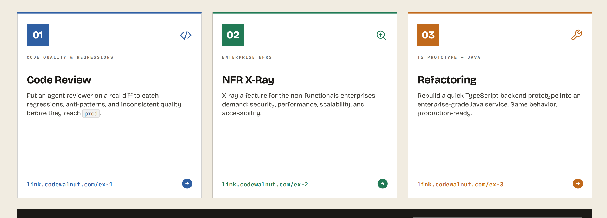

# Agentic Coding Exercises



This repository contains three hands-on exercises for practicing agentic coding workflows. Each exercise is designed for a learner to fork the repository, use an AI coding agent as a collaborator, and submit their solution as a pull request for review.

The canonical repository is meant to stay unchanged. Learner pull requests are reviewed, discussed, and closed by maintainers instead of merged into `main`.

Each exercise includes code inside its folder. Some projects are intentionally broken or incomplete because the exercise is to review, harden, or refactor that code.

## Exercises

| # | Exercise | Focus | Link |
|---|---|---|---|
| 01 | Code Review | Catch regressions, anti-patterns, and inconsistent code quality in a realistic diff. | [Start exercise 01](./exercises/ex-1-code-review/README.md) |
| 02 | NFR X-Ray | Audit enterprise-grade non-functional requirements: security, performance, scalability, accessibility, observability, and operability. | [Start exercise 02](./exercises/ex-2-nfr-xray/README.md) |
| 03 | TS Prototype to Java | Rebuild a quick TypeScript backend prototype as an enterprise-grade Java service while preserving behavior. | [Start exercise 03](./exercises/ex-3-refactoring/README.md) |

## How To Participate

1. Fork this repository.
2. Choose one exercise.
3. Create a branch in your fork, for example `solution/ex-1-your-name`.
4. Use your coding agent to complete the exercise.
5. Commit your work with notes, tests, and evidence.
6. Open a pull request back to this repository.

Maintainers will review solution PRs for feedback. Solution PRs should not be merged, because `main` is the reusable exercise source.

## Suggested Submission Paths

You can work directly in the exercise folders when the task requires code changes. For written deliverables, use:

```text
submissions/<github-handle>/ex-1/
submissions/<github-handle>/ex-2/
submissions/<github-handle>/ex-3/
```

Each exercise README explains its expected output.

## Repository Guardrails

- `main` is protected as the exercise source.
- Learners should submit pull requests from forks.
- Only maintainers/admins should close or manage PRs.
- Solution PRs are reviewed and closed, not merged.
- Exercise source changes should happen through explicit maintainer updates only.

See [CONTRIBUTING.md](./CONTRIBUTING.md) and [MAINTAINERS.md](./MAINTAINERS.md) for the operating model.
